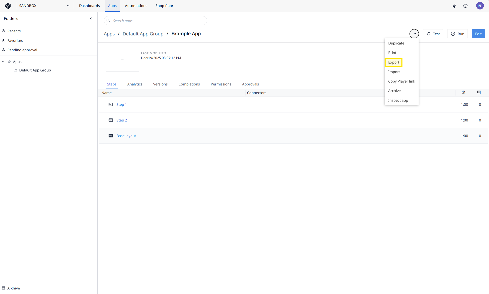
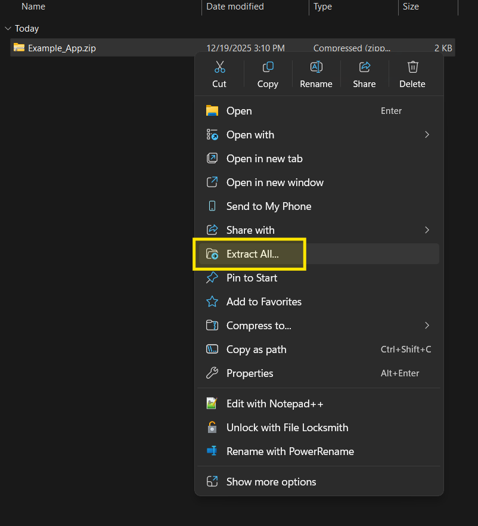
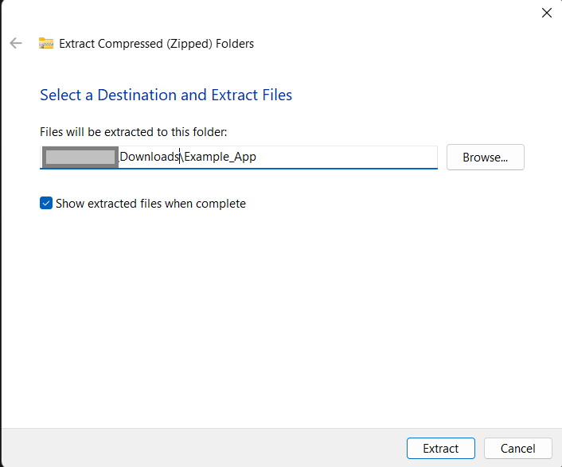
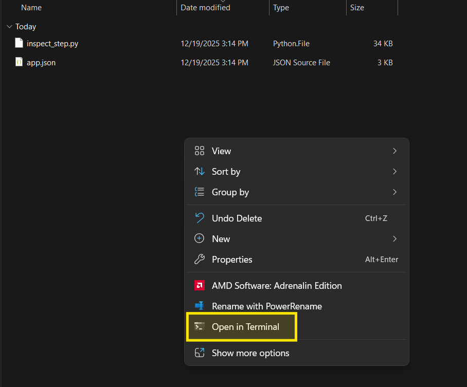
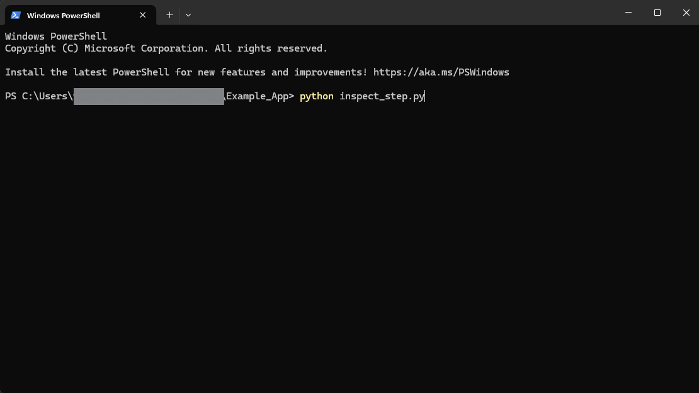
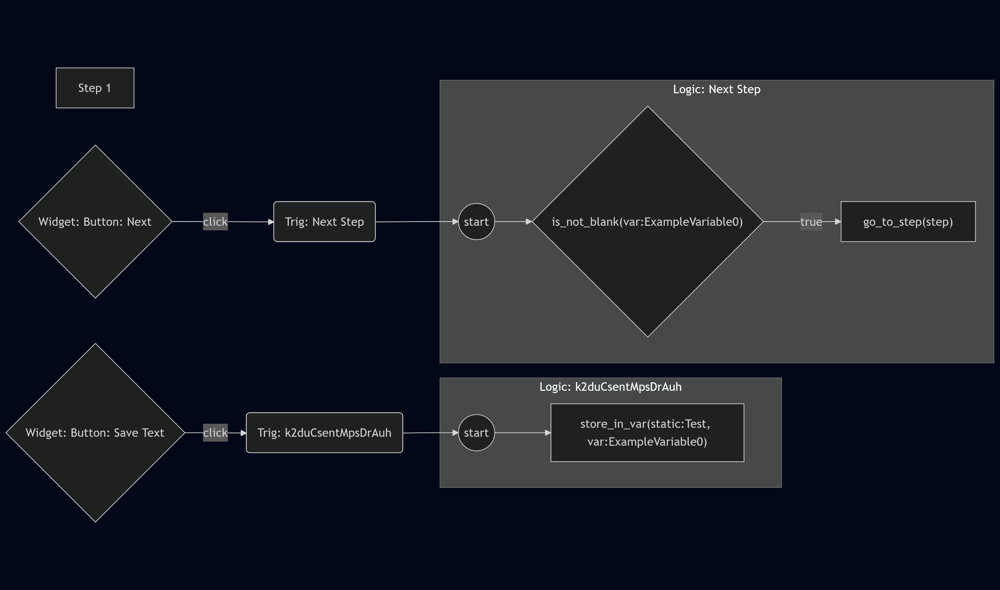

# PowerFlower
Handy Utilities for Tulip

## inspect_step.py
Exports step and widget trigger logic to mermaid markdown. 

### Preparation

1. Go to the Application overview page.
2. Click on the three dots to the left of the Test button 
3. Click Export 
4. Extract the zip file contents to a folder 

5. Copy the `inspect_step.py` file into the same folder as `app.json`  
Note that any folder is fine, just have both files there
6. Open that folder in the terminal 

### Run the Script

1. Run the script with `python inspect_step.py` 
2. Select which step you want converted and you can copy the mermaid markdown text to your favorite viewer. For something quick and easy I recommend [mermaid.live](https://mermaid.live/edit)  


### Outputs

#### Per-step header block
* `### Step <i>/<total>: <name> [id=<id>]`
* `================ Step summary ================`
* Step details
  * ID, name, parent step group, cycle time
* Trigger IDs
* Widget IDs

#### Per-step trigger block
`================ Step triggers (grouped) ================`
Triggers direcly associated with the step (i.e. not on a widget) split into five categories: 
* On step enter
* Timers
* Machines & devices
* On step exit
* Other

Details underneath each:
* Event type
* Clauses
* Conditions
* Actions

#### Widget Blocks (per step)
* `================ Widgets with triggers on this step ================`
* mermaid flowchart that includes:
  * step↔trigger wiring
  * widget→trigger wiring
  * trigger→step transition wiring
  * per-trigger `Logic:` subgraphs (conditions/actions)

### Bonus

If you want to save a specific step directly to a text file, you can run the command the following way:   
`python inspect_step.py app.json stepID > textFileName.txt`  
This tells the script that we want to use the `app.json` file and only want content from the `stepID` provided. 

Here's an example:  
`python inspect_step.py app.json uyYnM8nKD9xcYoHzh > step1.txt`

```step1.txt
Loaded 3 step(s) from app.json.

======================================================================
### Step 1/1: Step 1 [id=uyYnM8nKD9xcYoHzh]
================ Step summary ================
Step ID: uyYnM8nKD9xcYoHzh
Name: Step 1
Parent process: nZZbZYBokv9TTKDKA
Parent step group: None
Takt time: 60

Direct trigger IDs (0): []
Widget IDs (2): ['dkoxicv7687iXCoXA', 'k3f3cXczHntZ3sK5v']

================ Step triggers (grouped) ================

=== On step enter (0) ===
  (none)

=== Timers (0) ===
  (none)

=== Machines & devices (0) ===
  (none)

=== On step exit (0) ===
  (none)

=== Other (0) ===
  (none)

================ Widgets with triggers on this step ================

Widget type: button (count: 2)
  - dkoxicv7687iXCoXA: Button [BUTTON text: 'Save Text'] -> triggers: k2duCsentMpsDrAuh ()
  - k3f3cXczHntZ3sK5v: Button 1 [BUTTON text: 'Next'] -> triggers: 6bpnMpPZfaYnhqkyz (Next Step)

================ Mermaid (step + trigger logic) ================
flowchart LR
  step_uyYnM8nKD9xcYoHzh["Step 1"]
  wid_dkoxicv7687iXCoXA{"Widget: Button: Save Text"}
  trig_k2duCsentMpsDrAuh("Trig: k2duCsentMpsDrAuh")
  wid_k3f3cXczHntZ3sK5v{"Widget: Button: Next"}
  trig_6bpnMpPZfaYnhqkyz("Trig: Next Step")
  wid_dkoxicv7687iXCoXA -->|click| trig_k2duCsentMpsDrAuh
  wid_k3f3cXczHntZ3sK5v -->|click| trig_6bpnMpPZfaYnhqkyz
  subgraph trig_k2duCsentMpsDrAuh_logic["Logic: k2duCsentMpsDrAuh"]
    trig_k2duCsentMpsDrAuh_start(("start"))
    trig_k2duCsentMpsDrAuh_a1["store_in_var(static:Test, var:ExampleVariable0)"]
    trig_k2duCsentMpsDrAuh_start --> trig_k2duCsentMpsDrAuh_a1
  end
  trig_k2duCsentMpsDrAuh --> trig_k2duCsentMpsDrAuh_start
  subgraph trig_6bpnMpPZfaYnhqkyz_logic["Logic: Next Step"]
    trig_6bpnMpPZfaYnhqkyz_start(("start"))
    trig_6bpnMpPZfaYnhqkyz_c1{"is_not_blank(var:ExampleVariable0)"}
    trig_6bpnMpPZfaYnhqkyz_a1["go_to_step(step)"]
    trig_6bpnMpPZfaYnhqkyz_start --> trig_6bpnMpPZfaYnhqkyz_c1
    trig_6bpnMpPZfaYnhqkyz_c1 -->|true| trig_6bpnMpPZfaYnhqkyz_a1
  end
  trig_6bpnMpPZfaYnhqkyz --> trig_6bpnMpPZfaYnhqkyz_start
```

And here's the mermaid markdown rendered:

